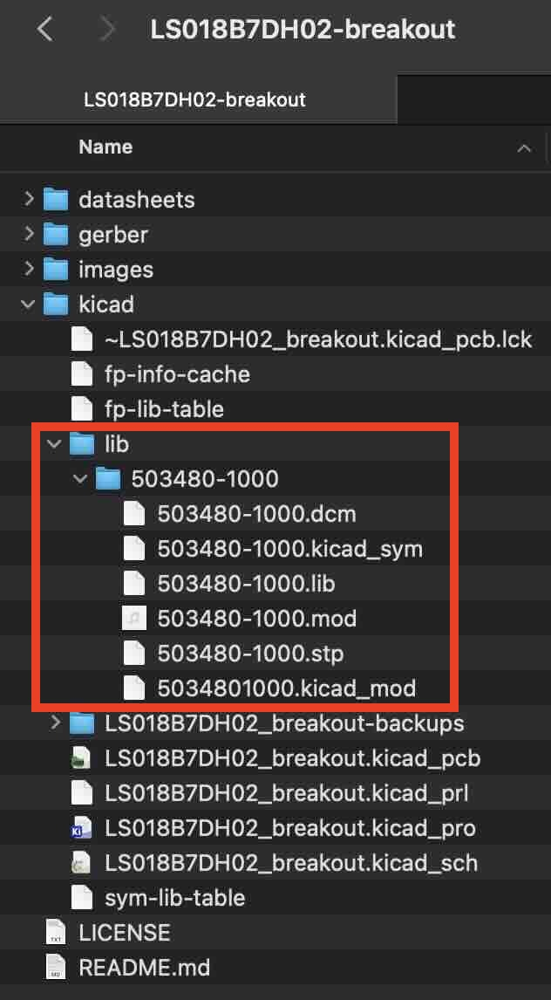

# Sharp LS018B7DH02 Memory LCD breakout board

> [!WARNING]
> The information and material (code, designs, files, ...) are provided "AS IS". We make no representation or warranty of any kind, express or implied, regarding the accuracy, adequacy, validity, reliability, availability, or completeness of any information or material. Use this at your own risk.

## Introduction

This repository contains a small breakout board for the Sharp LS018B7DH02 Memory LCD.

Also see this repository for an Arduino driver for this display:
[https://github.com/rroels/Sharp\_LS018B7DH02\_Arduino](https://github.com/rroels/Sharp_LS018B7DH02_Arduino)

## Design Considerations

### "Refresh" signal

To explain in layman's terms, this type of display needs a periodic "refresh signal" (even if you don't intend to change the displayed image), otherwise pixels start to get stuck (until the display is reset). 

It's not actually a refresh of the display, but rather a "polarity inversion".  A shortended explanation from the Sharp "[Programming Sharp’s Memory LCDs](https://www.sharpsde.com/fileadmin/products/Displays/2016_SDE_App_Note_for_Memory_LCD_programming_V1.3.pdf)" documentation:
 
> When designing with a memory LCD panel, a decision must be made as to how VCOM will be generated. VCOM is an alternating signal that prevents a DC bias from being built up within the panel. If this DC bias is
allowed to accumulate, it will eventually reach the point where the state of the liquid crystals in the panel
cells cannot be changed by the panel electronics and the cells will no longer change state. 

> It must be supplied using one of two methods: software, or external clock. The mode is selected by the EXTMODE pin on the interface.

> * If external clock is selected [EXTMODE = H], the clock should be supplied on the EXTCOMM pin. 
> * When the software clock is selected [EXTMODE = L], bit V of the command bit string sets the state of VCOM.

Depending on the chosen method, hardware is configured in one of two ways:

This breakout board should allow either hardware setup. This is done by setting a jumper that connects EXTMODE to either VSS or VDD. The user is still responsible for providing the refresh signal, either via software commands or via an external clock signal, depending on how the jumper is placed. 

When the user chooses for the software clock option, EXTCOMIN should be tied to GND. This is also possible with a jumper.

### VDD = VDDA

Typically, most designs combine digital power supply and analog power supply. This leaves the option to supply them seperately, but they can also be combined by placing a jumper. When the jumper is in placed, you only need to connect either VDD or VDDA.

### SCS Pull-down

It's good practise to have a pull-up for SPI chip-select lines:
* https://dorkbotpdx.org/blog/paul/better_spi_bus_design_in_3_steps/
* https://hackaday.com/2014/11/25/better-spi-bus-design/

HOWEVER, note that the SCS is active high for this display, and not active low like most SPI devices. For this reason, we provide an optional pull-down resistor, instead of a pull-up resistor. This can be enabled by placing a jumper.

## Schematics

We base ourselves on the following recommended circuits from the datasheet:

Which led to the following schematics:

## Bill of Materials (BOM)

|Reference|Footprint|Value|Qty|
|---|---|---|---|
|J6,J4,J5|PinHeader\_1x02\_P2.54mm\_Vertical|Conn\_01x02|3|
|C1|C_0603\_1608Metric\_Pad1.08x0.95mm\_HandSolder|0.1uF|1|
|C3,C2|C\_0603\_1608Metric\_Pad1.08x0.95mm\_HandSolder|1uF|2|
|J3|PinHeader\_1x03\_P2.54mm\_Vertical|Conn\_01x03|1|
|J2|5034801000|Conn\_01x10|1|
|J1|PinHeader\_1x09_P2.54mm\_Horizontal|Conn\_01x09|1|
|R1|R\_0603\_1608Metric\_Pad0.98x0.95mm\_HandSolder|10K|1|

See image of the PCB below to have a better idea of what these components look like. 

All capacitors and resistors and SMD 0603. Instead of the horizontal pin header I used, a vertical pin header will also work fine (as long as the pitch is 2.54mm).

## How to Obtain the Physical PCB

The Gerber file is in this repository (`gerber/LS018B7DH02-breakout.zip`). Simply upload this file a PCB manufacturer of your choice (JLPCB, PCBWay, ...), and you they will make it for you for as low as \$5 for 5 pieces (with the cheapest shipping option, which can take a few weeks).

> [!WARNING]
> Note that will still have to solder the components onto the PCB yourself!

## How to Edit Design

Everything you need to edit this design in KiCad 8 is included in the repository. 

However, this project uses symbols, footprints and 3D models from [Component Search Engine](https://componentsearchengine.com/). Their license allows us to do pretty much whatever we want with them, except redistributing them. For this reason I can't include them in this repository. 

If you would like to edit the design yourself, you will need to download the following component libraries from [https://componentsearchengine.com/](https://componentsearchengine.com/) (it's free!):

* [https://componentsearchengine.com/part-view/503480-1000/Molex](https://componentsearchengine.com/part-view/503480-1000/Molex) 

From the downloaded zip file, move the content of the `KiCad` and `3D` subfolders into the project structure, so that the end-result looks like this:

The KiCad project is configured to look for these files in these locations, using relative paths, so no changes to the project itself are required. 

## Related Sources

* [https://www.sharpsde.com/products/displays/model/ls018b7dh02/](https://www.sharpsde.com/products/displays/model/ls018b7dh02/)
* [https://www.sharpsde.com/fileadmin/products/Displays/Specs/LS018B7DH02\_31Oct23\_Spec\_LD-2023X08.pdf](https://www.sharpsde.com/fileadmin/products/Displays/Specs/LS018B7DH02_31Oct23_Spec_LD-2023X08.pdf)
* [https://www.sharpsde.com/fileadmin/products/Displays/2016\_SDE\_App\_Note\_for\_Memory\_LCD\_programming\_V1.3.pdf](https://www.sharpsde.com/fileadmin/products/Displays/2016_SDE_App_Note_for_Memory_LCD_programming_V1.3.pdf)
* [https://learn.adafruit.com/adafruit-sharp-memory-display-breakout/downloads#schematic-and-fabrication-print-2-dot-7-display-3070007](https://learn.adafruit.com/adafruit-sharp-memory-display-breakout/downloads#schematic-and-fabrication-print-2-dot-7-display-3070007)
* [https://bridle.tiac-systems.net/doc/3.2.0/zephyr/boards/shields/ls0xx_generic/doc/index.html](https://bridle.tiac-systems.net/doc/3.2.0/zephyr/boards/shields/ls0xx_generic/doc/index.html)
* [https://github.com/lvgl/lv_drivers/blob/master/display/SHARP_MIP.c](https://github.com/lvgl/lv_drivers/blob/master/display/SHARP_MIP.c)
* [https://kuzyatech.com/sharp-memory-lcd-breakout-a2](https://kuzyatech.com/sharp-memory-lcd-breakout-a2)

